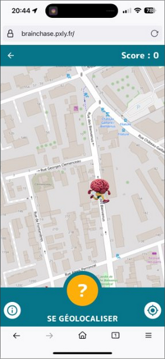

# My Best Youtube

## *Application*

L'application My Best YouTube est une application Android qui permettra de gérer une liste
personnelle des meilleurs vidéo trouvées sur YouTube. Pour Chaque vidéo on pourra renseigner son
titre, une description, l'url YouTube et choisir une catégorie (Sport, Music, Comédie, …).

## *Context de développement*

L'application sera développée sur mon PC Archlinux en Java avec Android Studio et le plugin
SonartLint pour optimiser au maximum le
code [Page officiel du plugin SonarLint](https://plugins.jetbrains.com/plugin/7973-sonarlint). <br>
Je vais utiliser mon téléphone de test sous Android 11, un Crosscall Core-X5 pour tester
l'application, et également un émulateur Android Pixel A3.

## *Notes*

- Si la base est vide au lancement de l'application, une entrée avec la toute première vidéo de
  YouTube sera ajoutée.

- J'utilise un iframe et donc javascript pour afficher la vidéo, je ne veux pas pas payer pour l'API
  de YouTube, et souhaite avoir un affichage directement dans l'application. <br>
  En contrepartie la sécurité sur cette page doit être renforcée à terme pour éviter les attaques
  XSS (cross-site scripting).

- J'ai utilisé le thème Catppuccin pour les couleurs de l'application, elles se prête bien à une
  application avec un thème clair et un theme sombre. Bien que n'ai pas eu le temps d'implementer
  cette feature, ainsi qu'une version en Anglais pour pleinement utilisé string.xml. Mais tout est en
  place pour une utilisation future <br>
  [Couleurs Catppuccin utilisées dans l'application](https://github.com/catppuccin/catppuccin) <br>

## *Détails de l'application*

#### *Toolbar*

Toutes les pages de l'application possèdent une toolbar avec un titre et un bouton pour revenir à la
page précédente. <br>
Les éléments propres au téléphone (bar du haut, bar de bouton du bas) sont exclus du sizing des
pages

#### *Page d'acceuil*

 <br>
Au lancement de l'application, on arrive sur la page d'accueil qui affiche la liste des vidéos
ajoutées. <br>
Au premier lancement comme dit précédemment, une vidéo sera ajoutée automatiquement. On retrouve sur
cette page différent éléments :

- Un bouton pour ajouter une vidéo
- Un spinner pour appliquer un filtre sur les videos affichées
- Une liste des vidéos ajoutées dans un RecyclerView, qui est clickable pour afficher les détails
  d'une vidéo <br>
- Un Slider pour filtrer les favoris ainsi que le catégories. <br>
  *Il est parfaitement fonctionnel, mais pour ne pas surcharger le README je vous laisserais le
  tester directement sur le slider de la page d'acceuil, et sinon je peux vous envoyer des screens
  supplémentaire*
  <br>

A améliorer :
*Une option pour supprimer toutes les vidéos serait le prochain ajout que je ferais à l'application*

#### *Page détail de la vidéo*

 <br>
En cliquant sur une vidéo de la liste, on arrive sur la page de détail de la vidéo clické. <br>
On retrouve sur cette page différent éléments :

- Toutes les informations de la vidéo (id, titre, description, catégorie, url, favori). <br>
  *Je n'ai pas implémenté de switch sur cette page, mais un message qui détail si la vidéo est en
  favorie ou non, car j'avais déjà mis en place un switch qui s'actualise en fonction du statut de
  la vidéo sur la page d'édition que je détail dans la prochaine partie.*
- Un bouton pour voir la vidéo
- Un bouton pour modifier la vidéo qui redirige sur une page de modification
- Un bouton pour supprimer la vidéo

A améliorer :

- *Un popin pour valider la suppression de la vidéo serait un ajout que je ferais quand j'aurais
  plus
  de temps*
- *Le boutons me paraissent un peu haut*

#### *Page de modification de vidéo*

 <br>
En cliquant sur le bouton de modification de la vidéo, on arrive sur la page de modification de la
video <br>
Sur la capture ci-dessus on retrouve la page tel qu'elle est sans rien modifier dessus. <br>
On retrouve sur cette page différent éléments :

- Un formulaire pour modifier les informations de la vidéo (titre, description, catégorie, url,
  favori) <br>
  *Les champs sont pré remplis avec les informations de la vidéo pour plus de pertinence, la
  catégorie sur la bonne entrée. Ainsi que
  comme demandé pour la page précédente de détail de la vidéo, le switch de favori qui est "true" si
  la vidéo est en favori*
- Les entrées du formulaire sont dans un ScrollView pour permettre de scroller si la taille de la
  page est trop petite sur des petit écrans (et pour que je teste le ScrollView sur Java Android)
- Un bouton pour valider la modifications de la vidéo et revenir à la page d'acceuil avec un message
  Toast pour confirmer la modification (ci-dessous) <br>
   <br>
- Si des champs sont vides, un message Toast indique que la modification n'a pas pu être effectuée,
  et les champs vides sont mis en évidences (ci-dessous) <br>
   <br>
- Un bouton pour annuler la modification de la vidéo et revenir sur la page de détail de la vidéo

#### *Page d'ajout de vidéo*

 <br>
Je passe directement à la page d'ajout de vidéo, car elle est très similaire à la page de
modification. <br>
Les deux pages appellent la même activité, la difference est faite par un boolean "*isEditing*" qui
est passé à true quand on appelle la page en version modification. <br>

Les différences avec la page de modification sont :

- Les champs sont vides, et à la place on retrouve des placeholder pour guider l'utilisateur
- Au lieu de modifier un élément déjà éxistant, on en crée un nouveau.
- le message Toast est différent, et indique que la vidéo a bien été ajoutée (ci-dessous) <br>
   <br>

Je vais prendre l'exemple de l'ajout de vidéo de l'énoncé (comme ci-dessous) pour montrer le
fonctionnement de la page pour regarder une vidéo. <br>
 <br>

#### *Page de lecture de vidéo*

 <br> <br>
Suite à l'ajout de la vidéo, on peut la lire en accédant au détails de la vidéo, puis en cliquant
sur le bouton "VOIR". <br>
On arrive sur une page qui affiche la vidéo dans un iframe. <br>

 <br>

*Le choix de l'iframe, et ces conséquences sont expliqués dans la partie "Notes" au début du
readme* <br>

#### Conclusion

L'application est fonctionnelle, et les fonctionnalités demandées sont implémentées. <br>
Il reste des améliorations à faire, mais l'application est utilisable en l'état. La mise en place à
été RecyclerView. J'ai beaucoup utilisé Android Studio pour mes projets sur Flutter, mais j'ai l'
impression de redécouvrir l'outil avec ce langage. Et les documentation sont très complètes c'est
agréable <br>

## *Liens utiles*

- [Procédure de connexion de téléphone en adb](Procédure_connexion_telephone_adb.md)
- [Documentation Android](https://developer.android.com/docs)
- [Couleurs Catppuccin utilisées dans l'application](https://github.com/catppuccin/catppuccin)

## *Autres projet*

Le lien du GitLab d'un projet d'application pour téléphone auquel j'ai participé dans le cadre du module de projet MESI : <br>
[Projet de course d'orientation](https://gitlab.com/projetMesi/BrainChaseRunner)

Une application de course d'orientation sur Flutter qui exploite les données de localisation pour se repérer sur une carte dans un parcours, puis répondre à des questions. <br>
L'application exploite les données de localisation, la requête de données sur une app back en Java, l'affichage d'une carte dynamique, la gestion de questionnaires et du DevOps. <br>

Elle est testable sur telephone à l'url: [BrainChaseRunner](https://brainchase.pxly.fr/)
(Il y'a un bouton caché sur le score pour validé le point de passage à toutes les distance)



## *Auteur*
Alvin KITA
Etudiant à l'ipi Lyon en concepteur développeur d'application full Stack
```